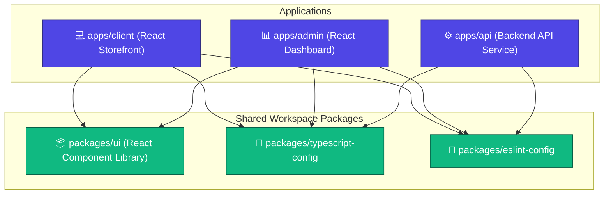

# 🛍️ Full-Stack E-Commerce Monorepo

Welcome to the **E-Commerce Monorepo**, an industry-grade, highly performant full-stack e-commerce platform. This project is structured as a **Turborepo** monorepo, designed for optimal development speed, pipeline caching, code sharing, and clean architecture boundaries.

---

## 🏗️ Repository Architecture

This repository uses **npm workspaces** and **Turborepo** to orchestrate three core applications and several shared packages:



---

## 🛠️ Tech Stack & Workspace Overview

### Applications (`apps/`)

- **`apps/client`**: The public-facing e-commerce storefront.
  - **Tech**: [React 19](https://react.dev/), [Vite](https://vite.dev/), [Tailwind CSS v4](https://tailwindcss.com/) (with Babel & React Compiler), TypeScript.
  - **Features**: Product listings, shopping cart, user checkout, search filters, order history.
- **`apps/admin`**: The internal back-office management panel.
  - **Tech**: React 19, Vite, Tailwind CSS v4, TypeScript.
  - **Features**: Inventory management, product editing, order fulfillment tracking, customer analysis dashboard.
- **`apps/api`**: The backend server powering both interfaces.
  - **Tech**: Node.js, Express (or equivalent Node framework), TypeScript.
  - **Features**: RESTful APIs, database integrations (ORM), auth middleware, payment gateway integrations, order processing queues.

### Shared Packages (`packages/`)

- **`@repo/ui`**: A shared React component library (e.g., buttons, inputs, modal dialogs) used consistently across both the `client` and `admin` portals to preserve UI/UX design tokens.
- **`@repo/typescript-config`**: Shared base TypeScript configurations (`tsconfig.json`) to enforce strict type checking across all workspace directories.
- **`@repo/eslint-config`**: Shared ESLint standard configurations to ensure strict code style, formatting, and linting guidelines.

---

## 🚀 Getting Started

Follow these steps to set up and run the project locally.

### Prerequisites

- **Node.js**: `v18` or higher (configured in `package.json` engines).
- **npm**: `v11` or higher (or your preferred package manager with workspace support).

### 1. Clone & Install Dependencies

```bash
# Clone the repository
git clone https://github.com/your-username/e-commerce.git
cd e-commerce

# Install dependencies for all apps and packages
npm install
```

### 2. Set Up Environment Variables

Each application contains a `.env.example` file. Copy this file to `.env` in the respective directories and customize the configuration.

```bash
# Example for apps/api
cp apps/api/.env.example apps/api/.env

# Example for apps/client
cp apps/client/.env.example apps/client/.env
```

### 3. Local Development

Start the development server for all projects simultaneously:

```bash
npm run dev
```

This starts the Vite dev server for `client` and `admin`, and watches the `api` and shared UI packages. Turborepo handles task orchestration and outputs logs concurrently.

#### Running a Specific Application (Filters)

If you only want to work on one part of the project, use Turborepo's `--filter` flag to minimize memory consumption:

```bash
# Start only the storefront (client)
npx turbo dev --filter=client

# Start only the administration dashboard (admin)
npx turbo dev --filter=admin

# Start only the API backend (api)
npx turbo dev --filter=api
```

---

## 🔨 Build & Production Ready

### Build All Workspaces

To bundle all applications and compile TypeScript for production:

```bash
npm run build
```

This will run type-checking, build the shared configurations, and compile the `client`, `admin`, and `api` assets. Turborepo caches successful builds to ensure subsequent builds compile only modified files, saving significant time.

### Verify Types & Linting

Validate the codebase's integrity before pushing code:

```bash
# Run ESLint across the entire workspace
npm run lint

# Run TypeScript compilation checks across all modules
npm run check-types

# Auto-format all TypeScript, React, and markdown files using Prettier
npm run format
```

---

## 📦 Monorepo Workflow

### Adding Dependencies

When adding packages, ensure you install them to the correct workspace rather than the root directory:

- **Add a dependency to a specific application** (e.g., adding `axios` to `apps/client`):
  ```bash
  npm install axios -w apps/client
  ```
- **Add a development dependency to the root** (e.g., adding `nodemon` or tooling):
  ```bash
  npm install nodemon --save-dev
  ```

### Adding New Shared Components

To add a new component to the shared library (`@repo/ui`):

1.  Navigate to `packages/ui` or use the component generator (if configured):
    ```bash
    npx turbo gen react-component
    ```
2.  Import and export it inside `packages/ui/src`.
3.  Any updates are immediately available to `client` and `admin` during development.

---


## 🗂️ Project Structure

```text
e-commerce/
├── apps/
│   ├── admin/             # Vite + React 19 Admin Dashboard
│   ├── api/               # Express / Node.js API Service
│   └── client/            # Vite + React 19 Customer Storefront
├── packages/
│   ├── eslint-config/     # Core ESLint configuration profiles
│   ├── typescript-config/ # Common TypeScript tsconfig configurations
│   └── ui/                # Shared React UI Component Library
├── package.json           # Monorepo root workspaces and config
├── turbo.json             # Turborepo task pipeline configuration
└── README.md              # Project documentation (You are here)
```


