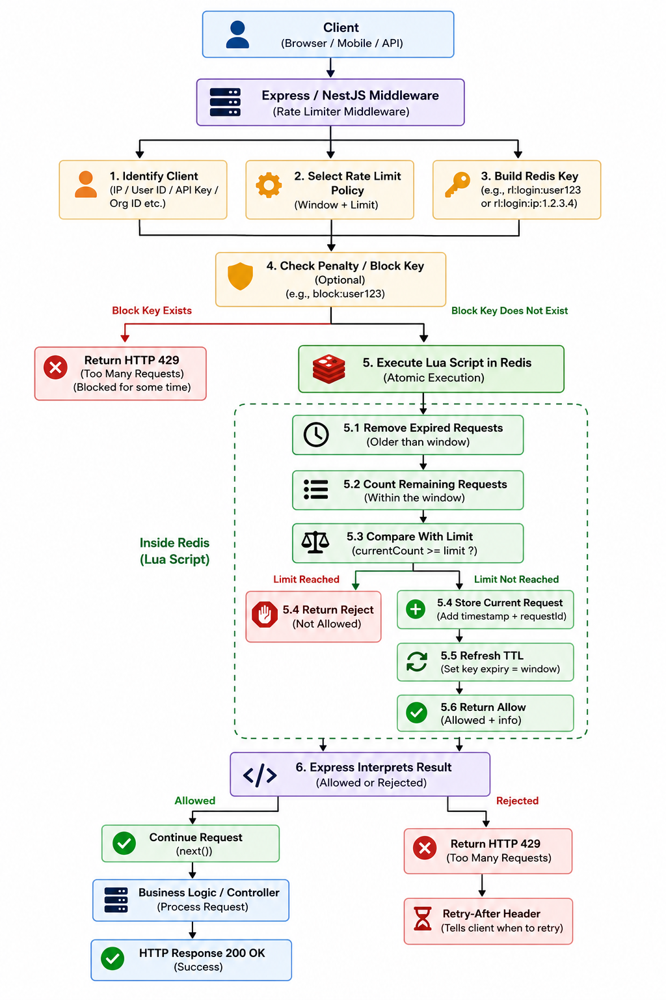

# E-Commerce (Full Stack)

A clothing store I'm building from scratch to learn how a real online shop works end to end:
accounts, a product catalog, a cart, checkout with real payments, and an admin side to run it.

It's a TypeScript monorepo with a React frontend and an Express + MongoDB backend. Some parts are
finished and some are still being wired together. The [status](#status) section says which is which.

## Tech stack

- **Frontend:** React 19, Vite, TypeScript, Tailwind CSS v4, shadcn/ui, TanStack Query, Zustand, React Router
- **Backend:** Node.js, Express 5, MongoDB with Mongoose, Redis, BullMQ
- **Shared:** Zod schemas in a workspace package, used by both the frontend and the backend
- **Payments:** Razorpay
- **Tooling:** pnpm workspaces, Turborepo, Docker (for Redis)

## Status

| Area | Where it's at |
|---|---|
| Sign up, login, logout, email verification, password reset, Google sign-in | Working, frontend and backend |
| Sessions (list and revoke logged-in devices) | Working |
| Rate limiting on auth routes | Working |
| Admin: create, edit and delete promo codes | Frontend done; backend routes written |
| Orders, promos, addresses | Backend routes and services written, not yet mounted in the server |
| Cart, wishlist, checkout, Razorpay payments, paying with points | Backend services written, routes in progress |
| Product catalog, product image processing | Backend models and jobs written; storefront pages still to build |

## What's interesting about it

These are the parts that took the most thinking.

### Authentication that behaves like a real app
- Short-lived access tokens (15 min) and long-lived refresh tokens (30 days), both in **httpOnly
  cookies**, so JavaScript on the page can't read them.
- The refresh cookie is only sent to `/auth/refresh`, not with every request.
- Every login creates a **session** in MongoDB. Logging out deletes it. You can see your active
  sessions and revoke one, which logs that device out.
- Email verification and password-reset links are single-use and expire.
- Google sign-in verifies the Google ID token on the server before creating or linking the account.

### Rate limiting with Redis
Login, register, verification and password-reset routes are rate limited per IP. On login and
password reset, the limit applies per IP **and** per email, so one person can't lock another out
by guessing their email. The limiter is my own Express middleware backed by Redis, using a sliding
window rather than fixed per-minute buckets.



### Slow work goes to background jobs
Sending emails and processing product images don't happen inside the request. The API puts a job
on a **BullMQ** queue in Redis, and a separate worker process picks it up, with retries and
backoff if something fails. That keeps the API fast, and a flaky email provider can't break signup.
In development, there's a dashboard at `/admin/queues` to watch the jobs.

### Checkout that can't oversell
Payments go through Razorpay. When a payment is confirmed:
1. The server checks Razorpay's signature using a constant-time comparison (`crypto.timingSafeEqual`).
2. Inside a **MongoDB transaction**, it decrements stock with a condition: only if enough stock is
   left. If two people buy the last item at the same moment, one order goes through and the other
   is rejected. The whole order rolls back instead of leaving the stock negative.

Users can also pay with loyalty points, which goes through the same checks.

### One set of validation rules
Request shapes (register, login, cart, checkout, promos…) are written once as **Zod** schemas in
`packages/types`. The backend validates requests with them, and the frontend uses the same schemas
in its forms and types, so the two can't drift apart.

### A consistent API and error handling
- Every response has the same shape: `{ status, data, meta?, errors? }`.
- The backend is layered: **route → controller → service → model**. Controllers only validate
  input and call one service. Services hold the business logic.
- Errors are thrown with a small `appAssert` helper and handled in one central error handler. So
  a bad request always gets a clean 400 with field errors, never a stack trace.

### Frontend data flow
- One axios instance that sends cookies and turns every error into the same simple shape.
- One TanStack Query hook per API call (`useLogin`, `useCreatePromo`, …), and each hook handles
  its own side effects: updating the cache, showing a toast, navigating.
- Zustand only holds client state, like the logged-in user.
- Routes are protected with wrapper components: guests are sent to login, and only admins can
  open `/admin`.

## Project structure

```
e-commerce/
├── apps/
│   ├── client/              React storefront + admin panel (one app, role-based routes)
│   └── backends/
│       └── mongo/           Express API + BullMQ workers
│           └── src/
│               ├── routes/        URL + middleware → controller
│               ├── controllers/   validate input, call a service
│               ├── services/      business logic and database queries
│               ├── models/        Mongoose schemas
│               ├── middleware/    auth, admin check, rate limiting, errors
│               ├── jobs/          queues, producers, workers, processors
│               └── utils/         jwt, cookies, email, dates…
├── packages/
│   ├── types/               shared Zod schemas and types
│   ├── ui/                  shared React components
│   ├── eslint-config/
│   └── typescript-config/
├── docker-compose.yml       Redis for queues and rate limiting
└── turbo.json
```

## Running it locally

You'll need Node 18+, pnpm 9, Docker, and a MongoDB database (a free
[MongoDB Atlas](https://www.mongodb.com/atlas) cluster works).

```bash
git clone git@github.com:venkateshg12/e-commerce-fullstack.git
cd e-commerce-fullstack
pnpm install

# Redis, for the job queues and rate limiting
docker compose up -d

# environment variables
cp apps/backends/mongo/.env.example apps/backends/mongo/.env   # fill in MongoDB, JWT, SMTP, Google, Razorpay
cp apps/client/.env.example apps/client/.env                   # VITE_API_URL=http://localhost:5000

pnpm dev                                    # frontend and API together
```

The API runs on `http://localhost:5000` and the frontend on `http://localhost:5173`.

Handy commands:

```bash
pnpm --filter client dev          # just the frontend
pnpm --filter auth-service dev    # just the API (it also starts the job workers)
pnpm --filter auth-service worker # the job workers as a separate process
pnpm lint
pnpm typecheck
```

## What's next

- Mount the order, promo and address routes, and add routes for cart, wishlist, checkout and products
- Build the storefront: product listing, product page, cart and checkout screens
- Admin screens for products and orders
- Deploy it

## What I learned

The biggest lesson was that the hard parts of a shop aren't the pages, they're the edge cases:
two people buying the last item, a forged payment confirmation, a logout that doesn't actually
log anyone out, someone hammering the login form. Most of the code above exists because of one
of those.
