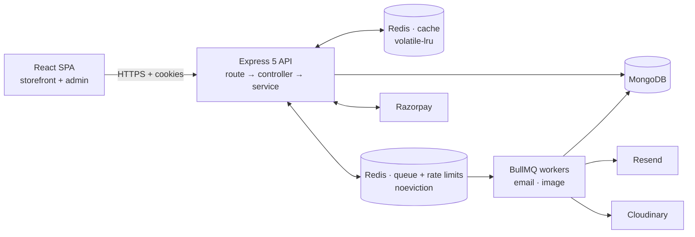
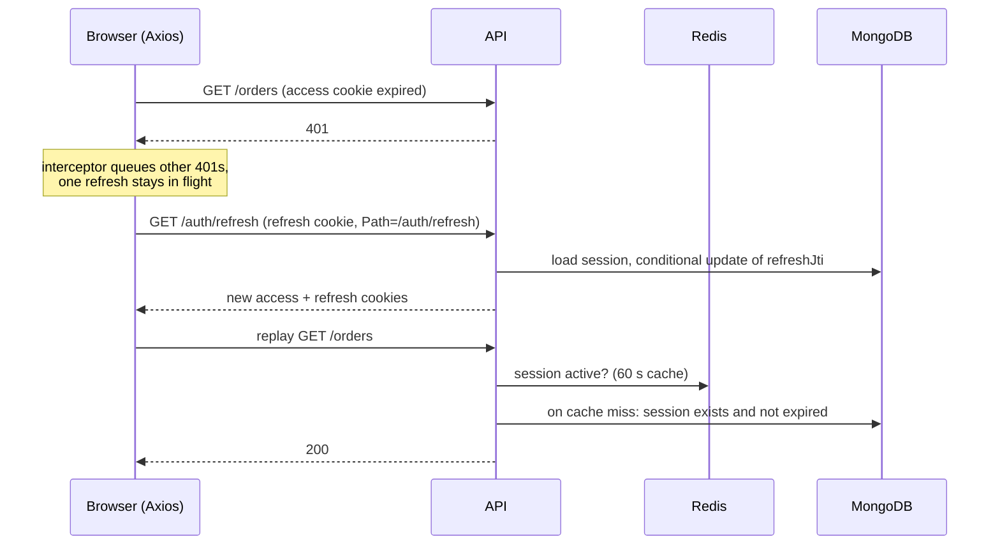
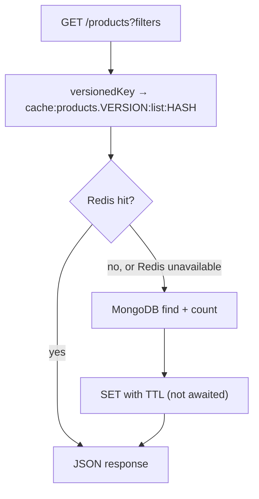
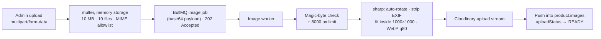
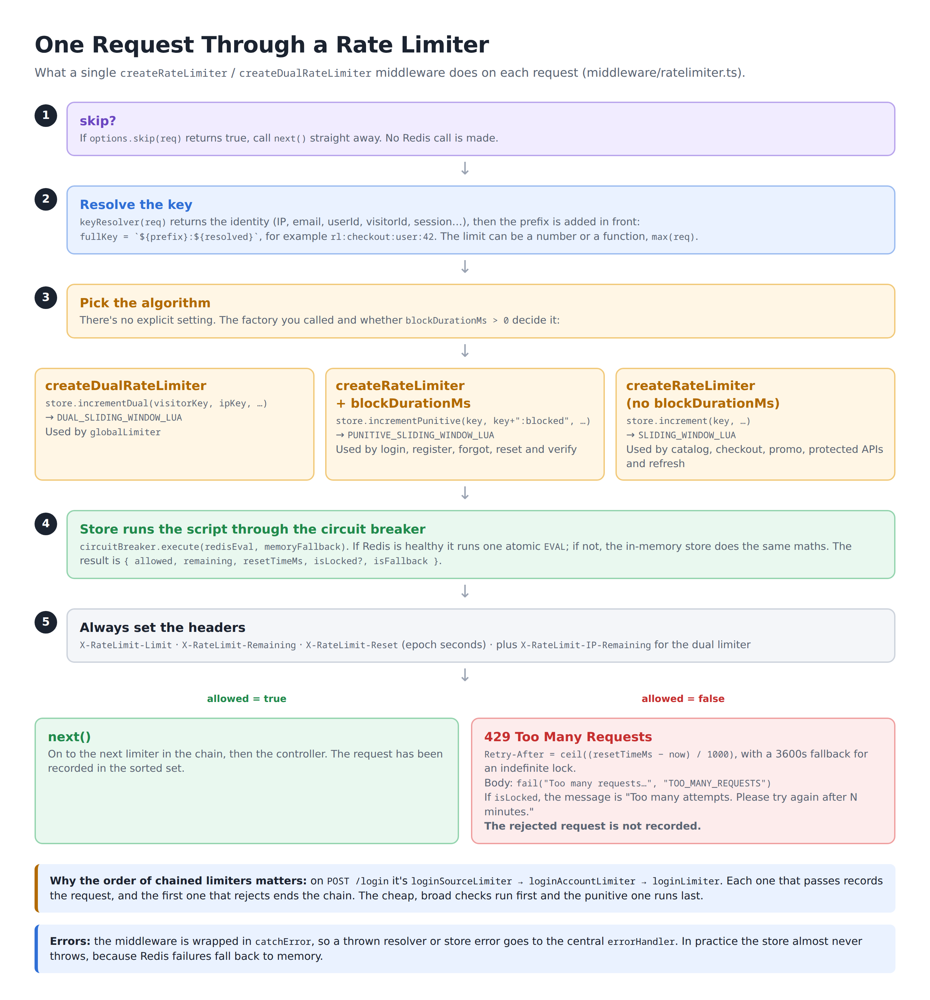
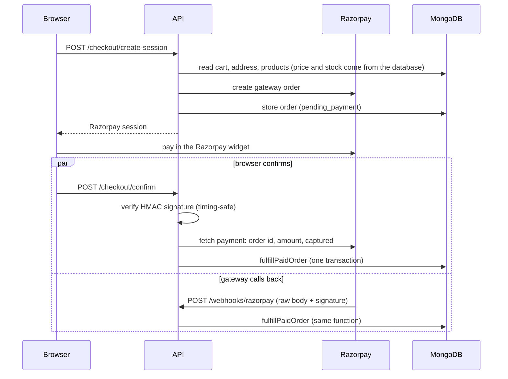

# E-Commerce Full Stack (ShopyMart)

A clothing store, end to end: storefront, admin panel, and an Express + MongoDB API with Redis caching, Redis-backed rate limiting, BullMQ background jobs and Razorpay payments.

It is a pnpm + Turborepo TypeScript monorepo: a React 19 app that holds both the customer storefront and the admin dashboard, a Node API, and a shared Zod schema package that both sides validate against. The interesting parts are the ones that are easy to get wrong: refresh-token rotation, an atomic Lua rate limiter with a circuit breaker, a cache with version-based invalidation, an idempotent payment-fulfilment transaction, and an image pipeline that runs outside the request.

> **Which backend runs the app?** `apps/backends/mongo`. The `postgres` and `nestjs` folders are learning ports of the same API — see [Learning ports](#-learning-ports-postgres-and-nestjs).

## ✨ Highlights

- **Access/refresh JWT sessions in httpOnly cookies**, with single-use refresh-token rotation, reuse detection and a server-side session that is checked on every request — [details](#-authentication--authorization)
- **Custom Redis rate limiter**: sliding-window log executed atomically in Lua, three algorithms (plain, punitive lockout, dual bucket), a circuit breaker, and an in-memory fallback when Redis is down — [details](#-rate-limiting)
- **Redis cache-aside layer** on a separate evicting Redis instance, with version-stamped namespaces for listings and per-entity keys for product pages — [details](#-redis--caching)
- **BullMQ workers** for email and image processing, with retries, backoff, idempotent processors and a basic-auth-protected Bull Board — [details](#-background-jobs--queues)
- **Image pipeline**: magic-byte validation, decompression-bomb guard, auto-rotate, EXIF strip, resize and WebP re-encode with `sharp` before upload to Cloudinary — [details](#-image-upload-pipeline)
- **Payments that can't oversell or double-fulfil**: HMAC signature check, gateway re-fetch (order, amount, captured), then one MongoDB transaction with conditional stock decrement; the Razorpay webhook calls the same idempotent function — [details](#-key-request-flows)
- **Stock per (colour, size) variant**, case-insensitive unique catalog names, filtered/sorted/paginated listings backed by compound indexes — [details](#-database)
- **One validation source**: Zod schemas in `packages/types` are used by the API for request validation and by the client for forms and types
- Centralised error handling (`appAssert` → `AppError` → one `errorHandler`), a uniform response envelope, graceful shutdown, and a health check that reports MongoDB and Redis separately

## 🏗️ Architecture


```mermaid
flowchart LR
    Client["React SPA<br/>storefront + admin"] -->|HTTPS + cookies| API["Express 5 API<br/>route → controller → service"]
    API --> Mongo[("MongoDB")]
    API <--> Cache[("Redis · cache<br/>volatile-lru")]
    API <--> Queue[("Redis · queue + rate limits<br/>noeviction")]
    Queue --> Worker["BullMQ workers<br/>email · image"]
    Worker --> Mongo
    Worker --> Resend["Resend"]
    Worker --> Cloudinary["Cloudinary"]
    API <--> Razorpay["Razorpay"]
```

The backend is strictly layered: **route → controller → service → model**.

- **Routes** attach URL, verb and middleware to a controller.
- **Controllers** are wrapped in `catchError`, validate input with a Zod schema from `@repo/types`, call exactly one service and respond through `ok(...)`.
- **Services** hold the business logic and Mongoose queries and fail fast with `appAssert(condition, status, message)`. They never touch `req` or `res`.
- **One error handler**, mounted last, turns `ZodError` into a 400 with field errors, `AppError` into its own status, Multer errors into readable 400s, and anything else into a logged 500.

Every JSON response uses one envelope, `{ status, data, meta?, errors? }`, built by `ok()` / `fail()`.

**Process model.** Importing `worker.ts` from `index.ts` runs the BullMQ workers inside the API process, which is the default. The same file can run standalone (`pnpm --filter auth-service worker`) so workers can move to their own process without code changes. Shutdown is ordered: stop accepting connections, let in-flight requests finish, close workers, close the cache connection, disconnect MongoDB, with a 10-second forced exit.

## 🔐 Authentication & Authorization

| Token | Lifetime | Cookie path | Secret |
|---|---|---|---|
| Access JWT (`aud: access`) | 15 min | `/` | `JWT_SECRET` |
| Refresh JWT (`aud: refresh`) | 30 days | `/auth/refresh` only | `JWT_REFRESH_SECRET` |

Both cookies are `httpOnly`; outside development they are `Secure` + `SameSite=None` (the storefront and API are on different sites). Algorithm is pinned to HS256 on sign and verify, and each token type has its own audience and secret, so one cannot be accepted as the other. The server refuses to boot if either secret is under 32 characters or if the two are equal.


```mermaid
sequenceDiagram
    participant B as Browser (Axios)
    participant A as API
    participant R as Redis
    participant M as MongoDB
    B->>A: GET /orders (access cookie expired)
    A-->>B: 401
    Note over B: interceptor queues other 401s,<br/>one refresh stays in flight
    B->>A: GET /auth/refresh (refresh cookie, Path=/auth/refresh)
    A->>M: load session, conditional update of refreshJti
    A-->>B: new access + refresh cookies
    B->>A: replay GET /orders
    A->>R: session active? (60 s cache)
    A->>M: on cache miss: session exists and not expired
    A-->>B: 200
```

**What happens on each request** (`middleware/authenticate.ts`): verify the access token's signature and audience → confirm the session document still exists and has not expired (a Redis hit skips the Mongo lookup for 60 s) → populate `req.userId`, `req.sessionId`, `req.role`. A valid signature alone is not enough, so logging out, resetting a password or revoking a device takes effect immediately instead of when the token expires.

**Refresh rotation** (`refreshUserAccessToken`): each refresh token carries a `jti`. Rotation is a single conditional `findOneAndUpdate` on `{ session, refreshJti: presented }`, so two concurrent refreshes cannot both rotate. If the presented token is stale, it is accepted only when it was replaced within the last 30 seconds (two tabs refreshing together); otherwise it is treated as replay and the whole session is revoked.

**Authorization.** Admin routes run `authenticate` then `requireAdmin`. `requireAdmin` re-reads the user's current role from MongoDB rather than trusting the role inside the token, so a demoted admin loses access immediately. On the client, `ProtectedRoute` and `RoleGuardLayout allow={["admin"]}` gate the `/admin` subtree.

**Sessions.** Each login creates a `Session` document (user agent, `refreshJti`, TTL index on `expiresAt`). Users can list their sessions and revoke one (`/session`). Every revocation path goes through `revokeSessions`, which also clears the Redis session cache key.

**Other auth details**
- Passwords are hashed with bcrypt at 12 rounds. An unknown email still runs a bcrypt compare against a throwaway hash, so response time does not reveal which emails are registered.
- Email-verification and password-reset tokens are stored as SHA-256 hashes, consumed with an atomic `findOneAndDelete`, and expire through a TTL index.
- Google sign-in verifies the Google ID token server-side (`google-auth-library`) before creating or linking an account.

## ⚡ Redis & Caching

Two Redis instances, on purpose (`docker-compose.yml`):

| Instance | Port | Policy | Holds |
|---|---|---|---|
| `redis` | 6379 | `noeviction`, AOF on | BullMQ queues, rate-limit windows |
| `redis-cache` | 6380 | `volatile-lru`, 256 MB, no persistence | Response cache, session-active flags |

A cache has to evict to stay bounded, but evicting a queue loses jobs, so they cannot share one policy.


```mermaid
flowchart TD
    Req["GET /products?filters"] --> Key["versionedKey → cache:products.VERSION:list:HASH"]
    Key --> Hit{"Redis hit?"}
    Hit -->|yes| Resp["JSON response"]
    Hit -->|"no, or Redis unavailable"| Mongo["MongoDB find + count"]
    Mongo --> Set["SET with TTL (not awaited)"]
    Set --> Resp
```

| Cached | Key | TTL | Invalidated by |
|---|---|---|---|
| Product listing + total | `cache:products.<v>:list:<sha1 of filters>` | 120 s | version bump on any product write; admin view is never cached |
| Product detail | `cache:product:detail:<id>` | 5 min | `invalidateProductDetails` on edits, image jobs, stock changes |
| Colour facets | versioned `facets` | 30 min | bumped only when colours or status can change |
| Category tree, brands | versioned `catalog` | 1 h | bump on catalog writes |
| Home feed | versioned catalog + products + promos + banners | 60 s | version bumps + TTL (it carries live stock numbers) |
| Active promos | `promos` | min(5 min, time to next start/end) | bump on promo writes |
| Admin dashboard | `cache:dashboard:<days>` | 60 s | TTL only |
| Session is active | `cache:session:<id>` | 60 s | `revokeSessions` |

**Invalidation has two styles** (`utils/cache/cache.ts`):
1. **Versioned namespaces** for entries that cannot be enumerated. Each domain has a counter; every key embeds the counters of the domains it reads; a write increments the counter, so old keys are never read again and age out. It is O(1) regardless of key count and avoids the race where a slow request writes stale data back after an invalidation (it writes under the old version).
2. **Per-entity keys** for product detail pages, deleted individually, so editing one product leaves every other cached page alone. Renaming a category, brand or type drops the pages of the products that embed that name.

**Failure behaviour.** The cache never throws. Redis down, slow or switched off (`CACHE_ENABLED=false`) all degrade to a cache miss and the request reads MongoDB. The same circuit breaker the rate limiter uses stops a hung Redis from adding its timeout to every request. Concurrent misses on one key share a single fetch in-process, so an expired hot key costs one query rather than one per in-flight request. A fetcher that throws caches nothing, so "not found" is never remembered.

## 🧵 Background Jobs & Queues

Sending email and processing images happen outside the request: the API enqueues a job and responds, and a worker does the slow, failure-prone part.

| Queue | Jobs | Attempts / backoff | Worker settings |
|---|---|---|---|
| `email-queue` | verify email, password reset | 5, exponential from 3 s | concurrency 5, limited to 2 jobs/second |
| `image-queue` | process product images, process banner images, delete Cloudinary assets | 3, exponential from 5 s | concurrency 4, 60 s lock |

Completed jobs are kept for an hour, failed ones for a week. Email producers deduplicate with deterministic job ids (for example `verify:<userId>:<token>`), so the same token is never queued twice.

**Processors are written to be retried safely.**
- The email processor validates its payload with Zod and throws `UnrecoverableError` for a malformed one (retrying it would be pointless), and skips if the user is gone or already verified.
- The image processor `$push`es new images atomically instead of read-modify-write, and on failure deletes the Cloudinary uploads from that run before rethrowing, so a retry starts clean. The product is marked `FAILED` only after the final attempt.
- The Cloudinary delete job holds no database write, so a retry is harmless; it throws when any asset fails so BullMQ retries it instead of leaving orphans.

**Monitoring.** Bull Board is mounted at `/admin/queues` only when `ENABLE_QUEUE_DASHBOARD=true` and credentials are set, behind basic auth compared with a timing-safe digest. It stays off by default because job payloads contain verification and reset tokens.

## 🖼️ Image Upload Pipeline


```mermaid
flowchart LR
    U["Admin upload<br/>multipart/form-data"] --> M["multer, memory storage<br/>10 MB · 10 files · MIME allowlist"]
    M --> J["BullMQ image job<br/>(base64 payload) · 202 Accepted"]
    J --> W["Image worker"]
    W --> V["Magic-byte check<br/>+ 8000 px limit"]
    V --> S["sharp: auto-rotate · strip EXIF<br/>fit inside 1000×1000 · WebP q80"]
    S --> C["Cloudinary upload stream"]
    C --> D["Push into product.images<br/>uploadStatus → READY"]
```

- **Validation happens twice.** Multer rejects by MIME type and size at the edge; the worker re-checks the file signature (magic bytes), so a renamed file is rejected, and refuses images larger than 8000 px per side.
- **Compression happens before upload**, so Cloudinary stores a smaller, orientation-corrected, metadata-free WebP. Images are never enlarged.
- **The request returns `202 Accepted`** immediately; `uploadStatus` moves `PENDING → PROCESSING → READY` (or `FAILED` with the error stored).
- Each image can be tagged with the colour it shows; the storefront uses the tag to pair swatches with photos. A batch can be inserted at a given position, and the worker guarantees exactly one cover image.
- Deleting images updates MongoDB in the request, then queues the slow Cloudinary deletion.

## 🛡️ Security

| Mechanism | Where |
|---|---|
| `helmet` headers (HSTS in production), CORS allowlist with credentials | `index.ts` |
| httpOnly cookies, `Secure` + `SameSite=None` outside dev, refresh cookie scoped to its own path | `utils/auth/cookies.ts` |
| JWT secret length / distinctness checks at boot, pinned algorithm, per-token audience | `constants/env.ts`, `utils/auth/jwt.ts` |
| Refresh rotation with reuse detection; live-session check on every request | `auth.service.ts`, `authenticate.ts` |
| bcrypt (12 rounds) + dummy-hash compare for unknown emails | `utils/auth/bcrypt.ts`, `loginUser` |
| Role re-read from the database on admin routes | `requireAdmin.ts` |
| Hashed, single-use, expiring verification/reset tokens | `verificationToken.ts`, `verifyEmail` |
| Zod validation of request bodies and params | controllers + `@repo/types` |
| Redis rate limiting on auth, checkout, promo, catalog and API routes | [Rate limiting](#-rate-limiting) |
| Trusted-proxy aware client IP (`TRUSTED_PROXY_CIDRS`); raw `X-Forwarded-For` is never trusted | `utils/rateLimiter/ipExtractor.ts` |
| Razorpay HMAC checked with `timingSafeEqual`; webhook verifies the raw bytes; app refuses to start in production without the webhook secret | `checkout.service.ts`, `webhook.controller.ts`, `index.ts` |
| Upload limits, MIME allowlist, magic-byte check, pixel limit | `middleware/upload.ts`, `utils/imageProcessor.ts` |
| Search text is regex-escaped before it reaches MongoDB | `product.service.ts` |
| Bull Board off by default, basic auth, timing-safe comparison | `index.ts` |
| `/debug-ip` exists only when `DEBUG_IP_ENDPOINT=true` | `index.ts` |

## 🚦 Rate Limiting

A custom limiter, not a library (`utils/rateLimiter/`, wired in by `middleware/rateLimiter.ts`, limits in `config/rateLimiter.ts`).

- **Algorithm:** sliding-window log. Each request is a member (`<ms>:<uuid>`) in a Redis sorted set scored by timestamp. One `EVAL` of a Lua script prunes expired members (`ZREMRANGEBYSCORE`), counts (`ZCARD`), finds the oldest survivor for an exact reset time, then either rejects or records the request (`ZADD` + `PEXPIRE`). It is atomic, so concurrent requests across API instances cannot both take the last slot, and there is no burst at window edges.
- **Three Lua variants.** *Single bucket* for ordinary limits. *Punitive*: exceeding the limit sets a lock key with a TTL and clears the window (used for login, register, forgot/reset password, email verification). *Dual bucket*: a per-browser bucket and a per-IP bucket checked together and committed only if both pass (the global pre-auth limiter: 500 per browser and 2000 per IP per 5 minutes).
- **Identity.** IP comes from `extractClientIp`: `CF-Connecting-IP` is honoured only when the TCP peer is in `TRUSTED_PROXY_CIDRS`, otherwise `proxy-addr` walks `X-Forwarded-For` through trusted hops only. Other keys: `ip:email`, `email`, session id (refresh), user id (checkout, promo, API), and an httpOnly `visitorId` cookie for anonymous browsers.
- **Login is limited on three axes** so neither spreading one account across many IPs nor walking many accounts from one IP slips through: per IP (50 / 15 min), per account (15 / 15 min, deliberately *not* punitive, so nobody can lock another user out by typing their email), and per IP+email (10 / 5 min, then a 30-minute lock).
- **Responses** carry `X-RateLimit-*` and `Retry-After`; 429 bodies use the standard envelope.
- **Fallback.** A circuit breaker (opens after 10 consecutive failures, probes again after 30 s with a single half-open request) switches to an in-memory store (capped at 20,000 keys, swept every minute). Redis commands use short timeouts so the breaker trips quickly. While it is open, limits apply per instance instead of globally.

There are 19 configured limiters in total. Diagrams: [`architecture_images/`](architecture_images/) (request flow, sliding window, algorithms, circuit breaker, client identity).



## 🗄️ Database

MongoDB through Mongoose 9. Transactions are used for money and stock, which requires a replica set (Atlas provides one).

| Collection | Notes |
|---|---|
| `User` | embedded addresses, loyalty `points`, `role` (`user`/`admin`), `authProvider` (`local`/`google`) |
| `Session` | refresh `jti` + previous `jti` for rotation; TTL index on `expiresAt` |
| `VerificationLink` | hashed token, type, TTL index on `expiresAt` |
| `Product` | embedded `variants` (colour, size, stock) and `images` (url, publicId, cover, colour); `uploadStatus` |
| `Category` / `SubCategory` / `Brand` | unique names with a case-insensitive collation; a type's name is unique within its category |
| `Cart` | one document per user (unique index); lines are matched by product + colour + size |
| `Wishlist`, `Promo`, `Banner` | one wishlist per user; unique promo code |
| `Order` | item snapshot, Razorpay ids, payment status, order status, timestamps |

**Indexes worth noting.**
- Product: `{status, createdAt}`, `{status, price}`, `{category, status}`, `{brand, status}`, `{subCategory, status}`, plus multikey indexes on `colors` and `sizes`, so the listing's filters and sorts are index-backed.
- Orders: `{user, createdAt}`, `{orderStatus, createdAt}`, `{paymentStatus, createdAt}`, and a unique `razorpayOrderId`.
- A partial TTL index deletes **cancelled** orders 12 hours after cancellation. The partial filter keeps it safe: an order paid after cancellation is revived and drops out of the index.
- TTL indexes on sessions and verification links remove expired documents automatically.

**Order lifecycle** is an explicit state machine shared by client and server (`ORDER_STATUS_TRANSITIONS` in `@repo/types`): `pending_payment → cancelled`, `placed → shipped → delivered → returned`. Admin transitions are validated against the order re-read inside a transaction. A customer can return a delivered order within 7 days; the return claims the status with a conditional update first, then restocks and credits points in the same transaction.

The `migrate:*` scripts in `apps/backends/mongo/src/scripts/` are one-off data migrations (catalog, variants, email normalisation), not a schema-migration framework.

## 📁 Project Structure

```
.
├── apps/
│   ├── client/                    React 19 + Vite storefront and admin dashboard
│   │   └── src/
│   │       ├── api/               one module per backend domain (Axios calls)
│   │       ├── hooks/<domain>/    one TanStack Query hook per operation
│   │       ├── lib/               Axios client with silent refresh, query client, guest bag, SDK loaders
│   │       ├── store/             Zustand (auth, UI state)
│   │       ├── pages/ components/ router.tsx
│   └── backends/
│       ├── mongo/                 The running API (package name: auth-service)
│       │   └── src/
│       │       ├── routes/ controllers/ services/ models/
│       │       ├── middleware/    authenticate, requireAdmin, rateLimiter, errorHandler, upload, visitorId
│       │       ├── jobs/          queues, producers, processors, workers, Bull Board
│       │       ├── utils/         auth, cache, rateLimiter, email, errors, api, cloudinary, imageProcessor, razorpay
│       │       ├── config/ constants/ types/ scripts/
│       │       └── index.ts, worker.ts
│       ├── postgres/              Learning port: Express + Prisma 8 on PostgreSQL
│       └── nestjs/                Learning plan only (documents, no code yet)
├── packages/
│   ├── types/                     @repo/types: Zod schemas + inferred types shared by client and API
│   ├── ui/  typescript-config/  eslint-config/
├── architecture_images/           rate limiter diagrams
├── docker-compose.yml             the two Redis instances
└── turbo.json, pnpm-workspace.yaml
```

The root `migrate.sh` is a leftover from an earlier layout plan; do not run it (it deletes the `nestjs` folder).

## 🔄 Key Request Flows

### Checkout and payment


```mermaid
sequenceDiagram
    participant U as Browser
    participant A as API
    participant Z as Razorpay
    participant M as MongoDB
    U->>A: POST /checkout/create-session
    A->>M: read cart, address, products (price and stock come from the database)
    A->>Z: create gateway order
    A->>M: store order (pending_payment)
    A-->>U: Razorpay session
    U->>Z: pay in the Razorpay widget
    par browser confirms
        U->>A: POST /checkout/confirm
        A->>A: verify HMAC signature (timing-safe)
        A->>Z: fetch payment: order id, amount, captured
        A->>M: fulfillPaidOrder (one transaction)
    and gateway calls back
        Z->>A: POST /webhooks/razorpay (raw body + signature)
        A->>M: fulfillPaidOrder (same function)
    end
```

- Prices, discounts and stock are computed from the database; the client sends only an address id and an optional promo code.
- `fulfillPaidOrder` re-reads the order **inside** the transaction and returns if it is already paid, so a double click, a retry, or the webhook racing the browser cannot decrement stock twice.
- Stock is decremented with `updateOne` + `arrayFilters` on the one `(colour, size)` variant and only while it still holds enough; success is asserted on `modifiedCount`, because `matchedCount` is true for the product even when no variant matched. If two buyers take the last item, one transaction aborts and rolls back.
- The same transaction spends a promo use (`count > 0` condition), removes only the cart lines that were bought (not the whole cart), and marks the order paid.
- The webhook route is mounted before `express.json()` with `express.raw`, because the signature covers the exact bytes. It also covers the customer who pays and closes the tab. A payment-amount mismatch is logged and never auto-fulfilled.
- An abandoned payment can be resumed (`/checkout/resume-session`), and an unpaid order can be cancelled. A paid order cannot be cancelled yet; there is no refund path.
- Customers can instead pay with loyalty points (`/checkout/pay-with-points`); the points deduction and the stock decrement are one transaction.

### Browsing the catalogue
`GET /products` validates filters with `productAppliedFilterListQuerySchema` (search, category, brand, type, colour, size, sort, page, limit up to 100), builds one query, runs `find` and `countDocuments` in parallel, and returns rows in `data` with `{ page, limit, total, hasMore }` in `meta`. The storefront reads `meta.hasMore` with `useInfiniteQuery`. The public result is cached (see [Redis & Caching](#-redis--caching)).

### Guest cart to account
The cart and wishlist endpoints require a login, so a visitor's cart and wishlist live in `localStorage`. After any sign-in the client calls `/cart/sync` and `/wishlist/sync` to merge them into the account and clears the local copy. A failed merge never blocks login; the items stay for the next attempt.

## 🧰 Tech Stack

| Category | Technology | Purpose |
|---|---|---|
| Language | TypeScript | client, API and shared package |
| Monorepo | pnpm workspaces, Turborepo | scoped installs, task orchestration |
| Frontend | React 19, Vite, React Router 7 | SPA; React Compiler enabled |
| Frontend state | TanStack Query, Zustand | server data vs. client state |
| Styling | Tailwind CSS v4, shadcn/ui (Radix) | UI primitives, `@layer components` styles |
| Backend | Node.js, Express 5 | HTTP API |
| Database | MongoDB, Mongoose 9 | primary store; transactions, TTL and partial indexes |
| Cache / queue / limiter | Redis via `ioredis` (two instances) | response cache; BullMQ and rate limits |
| Jobs | BullMQ, Bull Board | email and image workers, queue UI |
| Storage | Cloudinary | product and banner images |
| Image processing | sharp | resize, orient, WebP encode |
| Email | Resend | verification and password-reset mail |
| Payments | Razorpay | orders, signature verification, webhook |
| Auth | `jsonwebtoken`, bcrypt, `google-auth-library` | JWT sessions, hashing, Google sign-in |
| Validation | Zod 4 | shared request schemas |
| Infrastructure | Docker Compose | local Redis instances |

## 🚀 Getting Started

**Prerequisites:** Node.js 18+, pnpm 9, Docker, a MongoDB deployment with a replica set (Atlas works), and accounts or keys for Cloudinary, Razorpay, Resend and a Google OAuth client ID.

```bash
git clone git@github.com:venkateshg12/e-commerce-fullstack.git
cd e-commerce-fullstack
pnpm install

# Redis: queue/rate limiter on 6379, cache on 6380
docker compose up -d

# Environment (fill in real values; see the tables below)
cp apps/backends/mongo/.env.example apps/backends/mongo/.env
cp apps/client/.env.example apps/client/.env

# The API consumes the compiled shared package
pnpm --filter @repo/types build

# API (also runs the BullMQ workers in the same process)
pnpm --filter auth-service dev

# Client, in a second terminal
pnpm --filter client dev
```

Open `http://localhost:5173`. Use the filtered commands above rather than a bare `pnpm dev`, which would also start the Postgres port and fail without its `DATABASE_URL`.

- **Standalone worker:** `pnpm --filter auth-service worker`.
- **Queue dashboard:** set `ENABLE_QUEUE_DASHBOARD=true` plus `QUEUE_DASHBOARD_USER` / `QUEUE_DASHBOARD_PASSWORD`, then open `http://localhost:5000/admin/queues` (the server refuses to start if the dashboard is enabled without credentials).
- **Becoming an admin:** there is no seed script. Register a user, then set `role` to `"admin"` on that user document in MongoDB.
- **Webhooks locally:** without `RAZORPAY_WEBHOOK_SECRET` the webhook route is not mounted (a warning is logged); in production the app refuses to start without it.
- **Checks:** `pnpm typecheck` and `pnpm lint` from the repo root.

## 🔑 Environment Variables

**API: `apps/backends/mongo/.env`.** Variables without a default must be non-empty or the server will not start.

| Variable | Description | Required |
|---|---|---|
| `PORT` | API port (the example uses 5000) | Yes |
| `NODE_ENV` | `development` or `production` | Yes |
| `MONGO_URI` | MongoDB connection string | Yes |
| `CORS_ORIGIN` | Comma-separated storefront origins | Yes |
| `JWT_SECRET`, `JWT_REFRESH_SECRET` | Two different secrets, 32+ characters each (`openssl rand -hex 32`) | Yes |
| `REDIS_HOST`, `REDIS_PORT` | Queue / rate-limit Redis | Yes |
| `RESEND_API_KEY`, `EMAIL_FROM` | Resend key and sender address | Yes |
| `SMTP_HOST`, `SMTP_PORT`, `SMTP_USER`, `SMTP_PASSWORD` | Validated at startup; mail is currently sent through Resend, so placeholders work | Yes |
| `GOOGLE_CLIENT_ID` | Google OAuth client ID (server verifies ID tokens with it) | Yes |
| `CLOUDINARY_CLOUD_NAME`, `CLOUDINARY_API_KEY`, `CLOUDINARY_API_SECRET` | Image storage | Yes |
| `RAZORPAY_KEY_ID`, `RAZORPAY_KEY_SECRET` | Payments | Yes |
| `UV_THREADPOOL_SIZE` | libuv thread-pool size (sharp and crypto use it); example uses 12 | Yes |
| `RAZORPAY_WEBHOOK_SECRET` | Signs webhook deliveries | Required in production |
| `TRUSTED_PROXY_CIDRS` | Proxies whose client-IP headers may be trusted (`127.0.0.1/32` on Render); empty if directly exposed | Recommended behind a proxy |
| `REDIS_USERNAME`, `REDIS_PASSWORD` | For a hosted Redis | No |
| `CACHE_REDIS_HOST`, `CACHE_REDIS_PORT`, `CACHE_REDIS_USERNAME`, `CACHE_REDIS_PASSWORD` | Cache Redis (defaults: queue host, port 6380) | No |
| `CACHE_ENABLED` | `false` bypasses the cache entirely | No (default `true`) |
| `CLIENT_URL` | Storefront origin used in email links (default: first `CORS_ORIGIN`) | No |
| `ENABLE_QUEUE_DASHBOARD`, `QUEUE_DASHBOARD_USER`, `QUEUE_DASHBOARD_PASSWORD` | Bull Board and its basic-auth credentials | No |
| `DEBUG_IP_ENDPOINT` | `true` exposes `/debug-ip` for checking proxy trust; leave off normally | No |

**Client: `apps/client/.env`**

| Variable | Description | Required |
|---|---|---|
| `VITE_API_URL` | Base URL of the API, e.g. `http://localhost:5000` | Yes |
| `VITE_GOOGLE_CLIENT_ID` | Google OAuth client ID for the sign-in button | Yes |

## 🧪 Testing

There are no automated tests yet: no test files, no test runner and no CI workflow. The checks that exist are TypeScript (`pnpm typecheck`, strict compilation across the workspace) and ESLint (`pnpm lint`). The concurrency-sensitive code (checkout, rotation, rate limiter) has been verified by hand rather than by a suite, and covering it is the first item under [Future improvements](#-future-improvements).

## 🐳 Docker

`docker-compose.yml` runs only the two Redis instances; the API and client run on the host and there is no application Dockerfile.

| Service | Port | Configuration |
|---|---|---|
| `redis` (`ecommerce-redis`) | 6379 | `--appendonly yes --maxmemory-policy noeviction`, named volume, health check |
| `redis-cache` (`ecommerce-redis-cache`) | 6380 | no persistence, `--maxmemory 256mb --maxmemory-policy volatile-lru`, health check |

```bash
docker compose up -d      # start
docker compose down       # stop (add -v to drop the queue volume)
```

A Postgres service for the learning port is present in the file but commented out.

## 📊 Engineering Decisions

**Why two Redis instances?** BullMQ loses jobs if keys are evicted, while a cache that cannot evict grows until it fails. `volatile-lru` only evicts keys that have a TTL, so every cache entry carries one and the version counters do not.

**Why version-stamped cache keys?** Listings depend on filters and pages, so their keys cannot be enumerated and deleted. Bumping a counter retires a whole domain in O(1) and closes the stale-write race. Product detail pages are the exception: they are keyed per product, so one edit does not flush the rest.

**Why background jobs?** Email delivery and image processing are slow and can fail independently of the user's request. Queueing keeps the API responsive, a flaky provider cannot break signup, and BullMQ supplies retry with backoff and failure history. The cost is that results are eventually visible, which is why uploads return `202` and carry a status.

**Why compress images in the worker before uploading?** Resizing, re-encoding and stripping metadata locally means Cloudinary receives and stores the optimised WebP, and it keeps CPU-heavy `sharp` work off the request path.

**Why access + refresh tokens with server-side sessions?** A short-lived access token limits what a leaked cookie is worth, and the refresh token keeps users signed in. Backing both with a session document makes logout, device revocation and password reset real, and rotation with reuse detection turns a copied refresh token into a detectable event.

**Why conditional updates and transactions instead of check-then-write?** Every race that matters here (last item in stock, promo uses, double confirm, double return, two refreshes) is decided by one atomic operation whose filter encodes the invariant, not by a read followed by a write.

**Why a custom rate limiter?** The requirements (per-IP and per-account limits on login, a lock-out that attackers cannot weaponise, a dual-bucket pre-auth limit, graceful behaviour when Redis is down) are not met by a stock per-IP counter. Atomicity comes from Lua; availability comes from the breaker and memory fallback.

**Why shared Zod schemas?** The request shapes are defined once, so the form a user fills and the request the server validates cannot drift.

## ⚡ Performance Considerations

No benchmarks or load tests exist in the repo, so there are no throughput numbers here. The optimisations that are actually implemented:

- Redis response cache for listings, product pages, facets, catalog, home feed, promos and dashboard aggregates, with a 60-second session-active cache in front of the session lookup
- Compound and multikey indexes matching the listing's filters and sorts; TTL indexes for expiry instead of sweeper code
- Pagination capped at 100 rows; the row page and its total are cached together so the count is not recomputed on every hit
- Parallel independent queries (`Promise.all`) in checkout, listings, home feed and dashboard
- Single-flight on cache misses so an expired hot key causes one fetch
- Image work moved out of the request; images are resized and stored as WebP
- Cloudinary asset deletion batched at 100 ids per call
- Email delivery rate-limited to 2 jobs per second; image jobs run four at a time

## 🧭 Learning ports: Postgres and NestJS

The same API is being rebuilt twice for practice. The rule is that **the API stays identical to the Mongo backend** (same routes, same envelope, same cookie auth), so the existing React client works as the test harness and switching backends means changing `VITE_API_URL`.

**`apps/backends/postgres`: Express + Prisma 8 (release candidate) on PostgreSQL (Neon).** Built phase by phase from `POSTGRES_BUILD_PLAN.md` and `architect/phase-*.md`. Currently implemented: auth with sessions and refresh rotation, brand / category / type CRUD, products (create, update, image metadata, cover and colour tagging, delete, filtered and paginated listing, detail, facets), and a cart service in progress. The queue and rate-limiter files have been copied over but are not mounted yet, and checkout, orders, promos, wishlist, cache and dashboard are not started. It is not the deployed backend.

What the port is for, in concrete terms:
- Constraints replace application checks: a unique `lower(name)` index instead of a collation plus pre-query, foreign keys that refuse to delete a referenced brand instead of `assertUnused`, `UPDATE … RETURNING`-style conditional writes.
- Raw, parameterised SQL where the ORM cannot express something (`unnest` for colour facets, array `@>` filters), with GIN and trigram indexes behind them.
- The Prisma 8 contract / migration / `db sign` workflow.

**`apps/backends/nestjs`: NestJS + Prisma 8, plan only.** The folder contains `NESTJS_BUILD_PLAN.md` and 13 phase documents; no source code has been written yet. The plan covers modules and dependency injection, guards, pipes, interceptors and filters, `@nestjs/bullmq`, structured logging and tests, with the three backends on ports 5000, 5001 and 5002.

## 🔮 Future Improvements

Not implemented; listed as realistic next steps.

- Automated tests for the money and concurrency paths (checkout fulfilment, refresh rotation, rate-limit atomicity) with an in-memory or containerised MongoDB and Redis, plus a CI workflow running lint, typecheck and tests
- A refund path so paid orders can be cancelled
- Structured logging with request ids and metrics on queue depth, cache hit rate and rate-limit rejections
- An application Dockerfile and a full `docker compose` stack
- Load testing the listing and checkout paths to produce real numbers
- Finishing the Postgres port (jobs, rate limiting, cart, checkout, cache, dashboard)
- API versioning

## 👨‍💻 Author

Venkatesh · [github.com/venkateshg12](https://github.com/venkateshg12)
